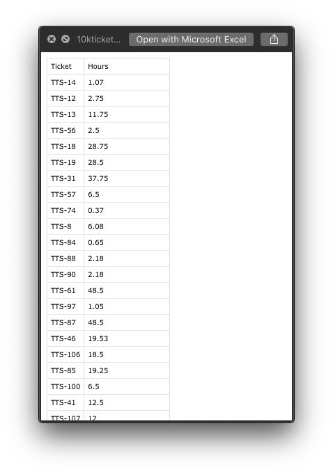

# 10kticketstat
A script to aggregate 10000ft.com (10K) statistics based on time entries matching a ticket pattern

## Prerequisites

1. [Node.js](https://nodejs.org/en/)
2. [A 10000ft.com API key](https://github.com/10Kft/10kft-api/blob/master/sections/first-things-first.md#authentication)

## Installation

```shell
npm install --global 10kticketstat
```

## Usage

For usage details, run `10kticketstat` without arguments:

```shell
% 10kticketstat

usage: 10kticketstat projectId outputPath apiKey
       [--api-url] [--start-iso-date] [--end-iso-date] [--ticket-pattern]
```

To mitigate excessive downloads, `--start-iso-date` defaults to one year prior to the moment the script is run.

The `projectId` is the id for any project or phase of a project. When you navigate to _Projects > [Project] > Worklist > [Phase]_ in the web interface, the URL should look like this:

```
https://app.10000ft.com/projects/1401981/worklist/phase/1401987
```

In this case, `1401981` is the project and `1401987` is the phase. Note that any hours logged to the phase will not be included in the results for the project as a whole. It’s up to you to aggregate that data if you need data across multiple phases.

Here’s an example with arguments:

```shell
% 10kticketstat 1401987 ~/Desktop $TENK_API_KEY

Downloaded data chunk #1 from 10K.
Downloaded data chunk #2 from 10K.
Downloaded data chunk #3 from 10K.
Downloaded data chunk #4 from 10K.
Downloaded data chunk #5 from 10K.
Downloaded data chunk #6 from 10K.
Download complete.
Done. Analysis saved to: /Users/adamshaylor/Desktop/10kticketstat.csv
```

 I had previously stored the API key as an environment variable `$TENK_API_KEY`. You can substitute the actual raw key if you prefer. The output should look something like this:


